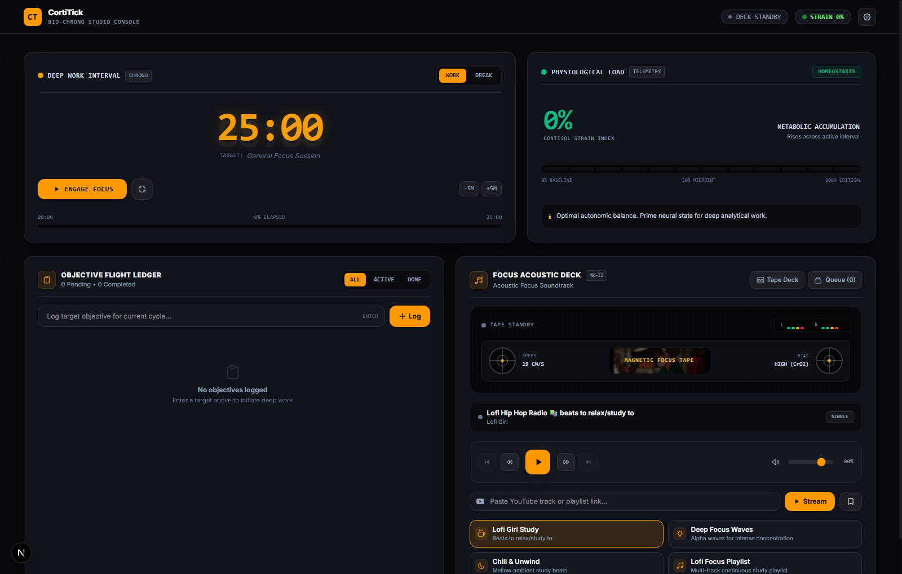

<div align="center">

# 🧠 CortiTick

**Pomodoro Timer · Task Manager · Cortisol Stress Gauge**

*Stay focused. Stay balanced. Stay healthy.*

[](https://nextjs.org/)
[](https://www.typescriptlang.org/)
[](https://tailwindcss.com/)
[](https://zustand-demo.pmnd.rs/)
[](https://opensource.org/licenses/MIT)
[](https://quanvo0112.github.io/CortiTick)

<br/>



</div>

---

## 📖 Description

**CortiTick** is a productivity web application reimagined as an authentic **Hardware Studio Console** (inspired by Dieter Rams Braun audio equipment and Teenage Engineering precision instruments). Beyond traditional Pomodoro timers, CortiTick integrates real-time physiological strain telemetry and continuous focus soundscapes into a unified, tactile desktop workspace.

Most focus tools tell you *when* to work and *when* to break — but they ignore how your neurological and physiological state evolves. CortiTick introduces a **Physiological Cortisol Barometer**: a dynamic tension gauge that responds to continuous focus and rest intervals. When cognitive strain accumulates, CortiTick provides contextual neuro-recovery guidance (such as 4-7-8 parasympathetic breathing protocols) to sustain high performance without burnout.

---

## ✨ Features

- **⏱️ Master Session Chronometer**
  - High-precision tabular countdown with ghost-backlit segment display (`88:88`)
  - Configurable Work (1–120 min) and Rest (1–60 min) intervals with tactile `[-5M]` / `[+5M]` steppers
  - Continuous linear **Chrono Ribbon** tracking progress across session milestones
  - Direct integration with the Objective Flight Ledger to display active focus targets

- **🧪 Physiological Cortisol Barometer**
  - Clinical 12-segment illuminated LED tension ladder showing estimated biological load (0–100%)
  - 4 distinct biological zones: *Homeostasis* (0–25%), *Optimal Flow* (25–60%), *Elevated Strain* (60–80%), *Exhaustion Threshold* (80–100%)
  - Real-time clinical recovery recommendations and autonomic balance telemetry

- ** Objective Flight Ledger**
  - High-density, keyboard-first task entry (`Enter` to submit)
  - Tactile mechanical switches with active target pinning (`SET TARGET`) to bind objectives directly to the active chronometer
  - Separate views for All, Active, and Completed objectives with hover deletion

- **🎵 Focus Acoustic Deck & Tape Machine**
  - **Tape Machine Mode**: Vintage-modern dual-spool cassette visualizer with animated spinning reels and real-time dual-channel stereo VU meters
  - **Video Stage Mode**: 1-click toggle to expand the 16:9 YouTube video player with monitor bezels
  - Master Tape Transport: Rewind 10s, Fast-Forward 10s, Play/Pause, Next/Previous, and precision volume gain
  - **Saved Focus Queue**: Continuous sequential auto-advance across saved YouTube tracks, with Shuffle and Loop modes
  - 4 Curated Studio Presets: Lofi Girl Study, Deep Focus Waves, Chill & Unwind, and Lofi Focus Playlist

- **⌨️ Tactile Hardware Shortcuts**
  - `[Space]`: Toggle Start / Pause interval
  - `[R]`: Reset active session
  - `[W]`: Switch to Deep Work mode
  - `[B]`: Switch to Rest Recovery mode

---

## 🛠 Tech Stack

| Category | Technology |
|---|---|
| **Framework** | [Next.js 15](https://nextjs.org/) (App Router) |
| **Language** | [TypeScript](https://www.typescriptlang.org/) |
| **Styling** | [Tailwind CSS](https://tailwindcss.com/) |
| **State Management** | [Zustand](https://github.com/pmndrs/zustand) |
| **Deployment** | [GitHub Pages](https://pages.github.com/) via GitHub Actions |

---

## 🚀 Getting Started

Follow these steps to run CortiTick locally on your machine.

### Prerequisites

- [Node.js](https://nodejs.org/) v20 or later
- [Git](https://git-scm.com/)

### Installation

**1. Clone the repository**
```bash
git clone https://github.com/quanvo0112/CortiTick.git
cd CortiTick
```

**2. Install dependencies**
```bash
npm install
```

**3. Start the development server**
```bash
npm run dev
```

**4. Open your browser**

Navigate to [http://localhost:3000](http://localhost:3000) — the app will hot-reload as you make changes.

---

## 📦 Build for Production

To generate a fully static export (as used in the GitHub Pages deployment):

```bash
npm run build
```

The output will be in the `./out` directory, ready to be served from any static file host.

---

## 🌐 Deployment

CortiTick is continuously deployed to **GitHub Pages** via a GitHub Actions workflow (`.github/workflows/deploy.yml`).

Every push to the `main` branch automatically:
1. Installs dependencies & runs `npm run build`
2. Uploads the `./out` static export as a Pages artifact
3. Deploys it live

**🔗 Live URL:** [https://quanvo0112.github.io/CortiTick](https://quanvo0112.github.io/CortiTick)

---

## 🤝 Contributing

Contributions, issues, and feature requests are welcome!

1. Fork the repository
2. Create your feature branch: `git checkout -b feat/your-feature`
3. Commit your changes: `git commit -m 'feat: add some feature'`
4. Push to the branch: `git push origin feat/your-feature`
5. Open a Pull Request

Please follow the existing code style and keep PRs focused on a single concern.

---

## 📄 License

This project is licensed under the **MIT License** — see the [LICENSE](LICENSE) file for details.

---

<div align="center">

Made with ❤️ by [quanvo0112](https://github.com/quanvo0112)

</div>
